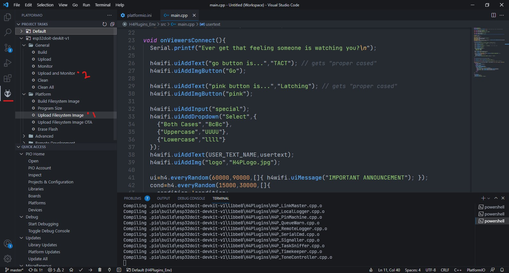

# H4Plugins PlatformIO environment for ESP32 and ESP8266

## Simple steps:
1. Ensure the target platform via platform icon > corner area > `esp32doit-devkit-v1` (for esp32) or `nodemcuv2` for ESP8266.
2. Upload flash file system (once).
    This can be achieved by the command `pio run -t uploafs`.
3. Upload the sketch.
    This can be achieved by the command `pio run -t upload`.

### Demonastration image

### Make sure [Git](https://git-scm.com) is installed.
This is important to clone the libraries with specific version from GitHub.